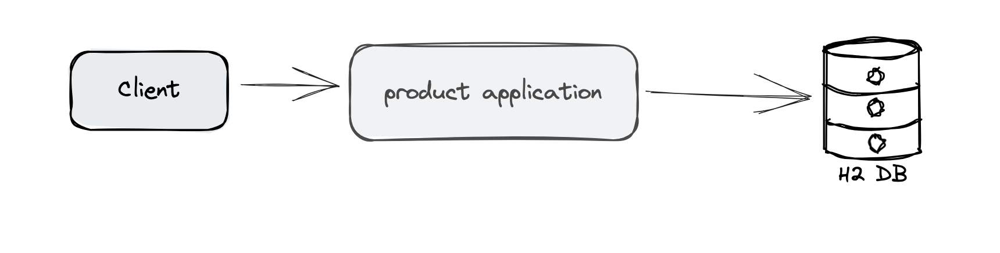

# Spring Data JPA Demo
This is a demo project of Spring Boot 3 with Spring Data JPA

## Architecture


## Tech Stack
+ Spring Boot 3
+ Spring Data JPA
+ H2 Database
+ Lombok
+ Maven


## What if using MySQL
Change `application.yaml` to following:
```yaml
spring:
  application:
    name: spring-data-jpa-demo

  datasource:
    url: jdbc:mysql://localhost:3306/mydatabase
    driver-class-name: com.mysql.cj.jdbc.Driver
    username: root
    password: rootpassword

  jpa:
    hibernate:
      ddl-auto: update
    show-sql: true
    properties:
      hibernate:
        dialect: org.hibernate.dialect.MySQLDialect

```

Add MySQL Driver Dependency in `pom.xml`
```xml
<dependency>
    <groupId>mysql</groupId>
    <artifactId>mysql-connector-java</artifactId>
    <scope>runtime</scope>
</dependency>

```
Then, run `mvn clean install`
Next, use MySQL Workbench to access MySQL Database and create `product` table.
Now you are ready to go.
